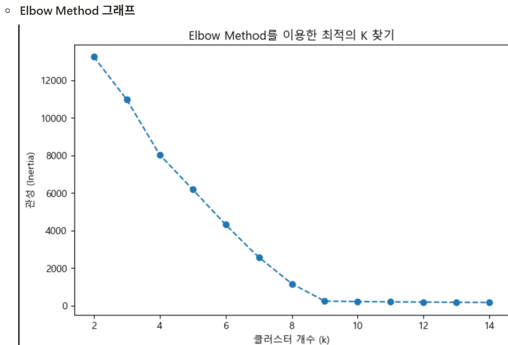
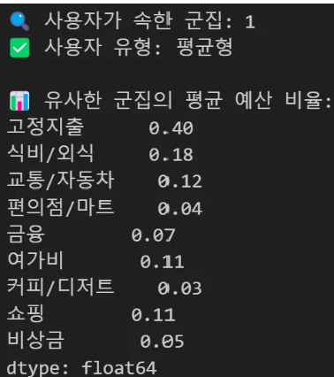
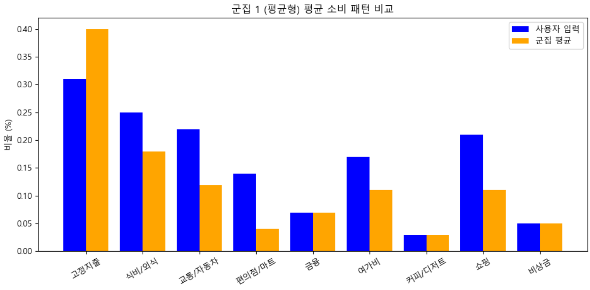
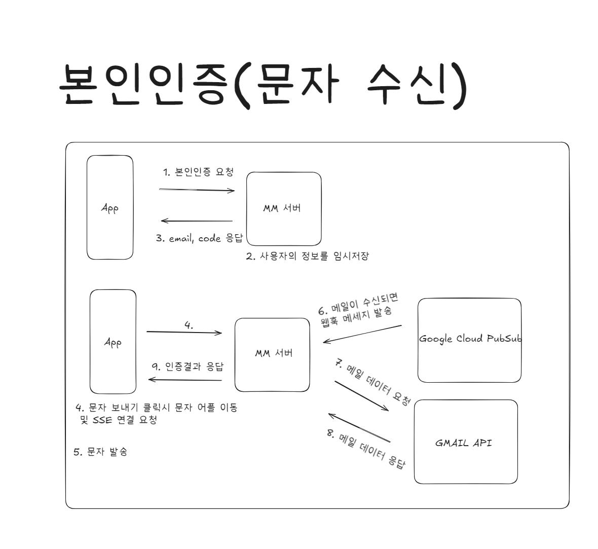
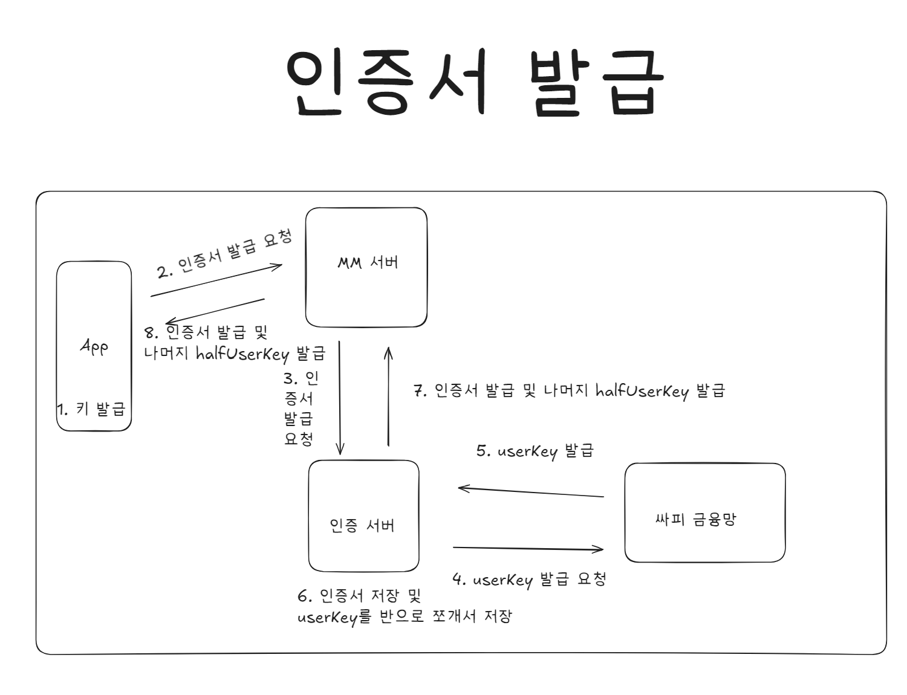

# 🍡 MM (Marsh Mellow)  
## 📌 팀명: GBH (효자손: Good Boy Hand) 
### 사회초년생 맞춤형 예산 관리 핀테크 플랫폼

> 💬 “한 달 예산을 체계적으로 관리하고 싶은데, 방법을 모르겠어요!”

🙋‍♀️🙋‍♂️ **사회초년생**이 쉽고 재미있게 예산을 관리할 수 있도록 도와주는  
💡 **개인 맞춤형 재정관리 앱**, 바로 **MM**을 소개합니다!

✨ AI 기반 예산 분배부터  
📊 소비 유형 분석,  
🎯 목표 저축 기능까지 한 번에!


---

## 🧩 프로젝트 개요

### 🎯 기획 배경
- 청년층의 재정 위기는 점점 심각해지고 있으며, 평균 대출액은 8,000만 원에 달합니다.
- 20대 4명 중 1명은 한 달 저축을 전혀 하지 못하고 있습니다.
- 예산 관리는 하고 싶지만, 방법을 몰라 포기하는 사회초년생이 많습니다.

### 🎯 기획 의도
- 사용자의 소비/자산 데이터를 바탕으로 **자동 예산 분배**와 **자동 저축 기능** 제공
- 재미있는 UI/UX와 캐릭터를 통해 스트레스 없는 재정 관리
- 누구나 앱 설치와 간단한 가입만으로 예산 관리를 시작할 수 있음

### 🎯 프로젝트 목적
> **사회초년생의 재정 관리를 효율적으로 지원하는 것**  
급여 수령 후 자동화된 예산 분배를 통해 재정적 안정과 경제적 자립을 유도합니다.

---
## 📱 주요 기능 소개
<table>
  <thead>
    <tr>
      <th align="center">기능 이름</th>
      <th align="center">기능 설명</th>
      <th colspan="2" align="center">화면</th>
    </tr>
  </thead>
  <tbody>
    <tr>
  <td align="center"><strong>🔐 ⓪ 로그인 및 인증서 발급</strong></td>
  <td align="center">
    <strong><em>두 번의 인증 체계로 소중한 데이터를 보호해줘요!</em></strong><br><br>
    <ul style="list-style: none; padding: 0;">
      <li>✅ <strong>1차 인증</strong>: 문자인증을 통한 본인 확인</li>
      <li>🔑 <strong>2차 인증</strong>: 핀번호 로그인 & 보안 키패드</li>
      <li>📄 <strong>마이데이터 연동</strong>: 인증서로 자산 불러오기</li>
    </ul>
  </td>
  <td align="center">
    
  </td>
  <td align="center">
    
  </td>
<tr>
  <td align="center"><strong>🧸 ① 통장 응원단</strong></td>
  <td align="center">
    <strong><em>귀여운 캐릭터가 나의 재정생활을 함께해줘요!</em></strong><br><br>
    <ul style="list-style: none; padding: 0;">
      <li>🎉 <strong>입금 축하</strong>: 월급 입금 시 캐릭터 알림</li>
      <li>📊 <strong>예산 추천</strong>: 소비 유형 기반 자동 분배</li>
      <li>📎 <strong>위시리스트 공유</strong>: 링크로 자동 등록</li>
    </ul>
  </td>
  <td align="center"></td>
  <td align="center"></td>
  <td></td>
</tr>

<tr>
  <td align="center"><strong>💰 ② 자산 관리단</strong></td>
  <td align="center">
    <strong><em>자산을 한눈에 보고 분석까지!</em></strong><br><br>
    <ul style="list-style: none; padding: 0;">
      <li>📈 <strong>자산 시각화</strong>: 리포트 기반 현황 제공</li>
      <li>🔍 <strong>간편 조회</strong>: 빠르게 확인 가능한 자산 정보</li>
      <li>💸 <strong>송금 기능</strong>: Marsh Mellow에서 바로 송금</li>
    </ul>
  </td>
  <td align="center"></td>
  <td align="center"></td>
  <td align="center"></td>
</tr>

<tr>
  <td align="center"><strong>📒 ③ 가계부 매니저</strong></td>
  <td align="center">
    <strong><em>AI가 도와주는 똑똑한 지출 관리</em></strong><br><br>
    <ul style="list-style: none; padding: 0;">
      <li>🤖 <strong>자동 분류</strong>: AI가 카테고리 분석</li>
      <li>📆 <strong>월별 분석</strong>: 지출 패턴 파악</li>
      <li>🔎 <strong>검색 기능</strong>: 필터링으로 손쉬운 조회</li>
    </ul>
  </td>
  <td align="center"></td>
  <td></td>
  <td></td>
</tr>

<tr>
  <td align="center"><strong>🌟 ④ 점메추 / 퇴사 망상록 / 포트폴리오</strong></td>
  <td align="center">
    <strong><em>일상과 커리어도 함께 챙겨요!</em></strong><br><br>
    <ul style="list-style: none; padding: 0;">
      <li>🍱 <strong>점메추</strong>: 점심 메뉴 추천으로 결정장애 탈출</li>
      <li>🧠 <strong>퇴사 망상록</strong>: 스트레스 해소를 위한 시뮬레이션</li>
      <li>🧳 <strong>포트폴리오</strong>: 내 커리어, 한눈에 정리</li>
    </ul>
  </td>
  <td align="center"></td>
  <td align="center"></td>
  <td align="center"></td>
</tr>

  </tbody>
</table>


---
## 🤖 AI 모델

> 사용자의 소비 내역을 기반으로 **가계부 자동 분류** 및 **소비 유형 분석** 기능을 제공합니다.

---

### 🗂️ ① 카테고리 분류 모델

#### 🔎 모델 정의

- **자산의 거래내역을 가계부 항목으로 자동 분류하는 모델**
- 사용 기술: `Python 3.9.13`, `Scikit-learn`
- 알고리즘: `DecisionTreeClassifier + CountVectorizer(range(1, 3))`

| 항목 | 값 |
|------|----|
| ⏱️ 학습 시간 | 약 764분 |
| 🎯 정확도 | 약 71% |
| 📦 모델 크기 | 약 600MB |
| 🧪 테스트 비율 | 20% |

#### 📊 학습 결과  


#### 📈 분류 성능  


---

### 🧠 ② 소비 유형 분석 모델

#### 🔎 모델 정의

> 사용자의 **소비 패턴을 클러스터링**하여 **9가지 유형**으로 분류하는 분석 모델입니다.
- 사용 기술: `Python 3.9.13`, `Scikit-learn`
- 알고리즘: `K-Means`
---

### 📊 데이터 구성 및 전처리

- **초기 데이터**: 팀원 및 지인의 소비 데이터를 기반으로 유형 지정 (🧾 `뱅크샐러드` 활용)
- **데이터 증강**: 초기 데이터 부족으로 다양한 소비패턴을 구성해 학습 볼륨 확보

#### 📌 Elbow Method
- 적절한 클러스터 수(K)를 찾기 위한 그래프
- `K=9`로 설정하여 총 **9가지 소비 유형** 분류



#### 📦 군집화 결과 (PCA 시각화)


```python
# 클러스터 ID → 실제 소비 유형
cluster_to_type = {
    0: "비상금형",
    1: "평균형",
    2: "cu점장형",
    3: "교통형",
    4: "미식가형",
    5: "절약형",
    6: "쇼핑중독자",
    7: "커피중독자",
    8: "여가형",
}
```

---

### 📈 분석 결과

#### 🔍 예측된 소비 유형


#### 🔍 사용자 소비 패턴 vs 군집 평균 비교


---

### 🧑‍💻 AI 모델 제작자의 고찰

#### 🗂️ 카테고리 분류 모델
- 전국의 소상공인 데이터를 기반으로 학습하여 **높은 정확도**를 확보했지만, 결과적으로 **모델 용량이 600MB**에 달해 **모바일 환경에서 사용하기엔 너무 무거운 모델**이 되었다.  
- 향후에는 **TensorFlow Lite** 등을 활용해 모델을 **경량화**하고, 실제 모바일 환경에서도 원활하게 작동할 수 있도록 개선할 예정이다.

#### 🧠 소비 유형 분석 모델
- 본 프로젝트에서는 **실제 사용자 소비 데이터를 확보하는 데 제약**이 있었기 때문에, **팀원 및 지인의 가계부 데이터를 수집**하여 초기 학습을 진행했다.  
- 다소 **제한적인 데이터셋**이었기에 군집화 결과에 **일반화의 한계**가 존재했으며, 추후에는 **대규모의 실제 소비 데이터를 기반으로 군집화**를 시도하여 **보다 정확하고 흥미로운 분석 결과를 도출**해보고 싶다.


## 🔐 본인인증 및 인증서 발급/전자서명 검증
> “나의 금융 정보, 제대로 인증된 사람만 확인할 수 있도록!”

---

### 📌 개요
MM은 민감한 마이데이터 및 자산 정보를 다루는 서비스이기 때문에,  
**이중 보안 체계**를 통해 사용자 본인 인증 및 인증서 기반 서명 검증을 철저히 수행합니다.

---

### ✅ 본인인증 흐름

<table>
  <thead>
    <tr>
      <th align="center">단계</th>
      <th align="center">내용</th>
    </tr>
  </thead>
  <tbody>
    <tr>
      <td align="center"><strong>1단계: 휴대폰 본인확인</strong></td>
      <td align="center">
        사용자의 <strong>이름 / 생년월일 / 통신사 / 전화번호</strong>를 입력하고,<br>
        문자인증을 통해 1차 본인 확인을 진행합니다.
      </td>
    </tr>
    <tr>
      <td align="center"><strong>2단계: PIN 입력</strong></td>
      <td align="center">
        사용자가 설정한 <strong>보안 PIN 4자리</strong>를 입력합니다.<br>
        <strong>보안 키패드</strong>를 통해 입력값을 보호합니다.
      </td>
    </tr>
    <tr>
      <td align="center"><strong>CI (연계정보) 발급</strong></td>
      <td align="center">
        본인 확인이 완료되면 사용자 고유의 <strong>CI값</strong>이 발급되어<br>
        이후 인증서 및 마이데이터 연동에 사용됩니다.
      </td>
    </tr>
  </tbody>
</table>

<p align="center">
  
  
</p>

---

### 📄 인증서 발급 및 전자서명 검증

<table>
  <thead>
    <tr>
      <th align="center">기능</th>
      <th align="center">설명</th>
    </tr>
  </thead>
  <tbody>
    <tr>
      <td align="center"><strong>인증서 발급</strong></td>
      <td align="center">
        MM은 사용자의 <strong>공개키를 기반으로 자체 인증서를 발급</strong>합니다.<br>
        발급된 인증서는 <strong>앱 내 저장소 또는 보안 모듈</strong>에 안전하게 저장됩니다.
      </td>
    </tr>
    <tr>
      <td align="center"><strong>전자서명 생성</strong></td>
      <td align="center">
        사용자 요청(마이데이터 연동 등) 시, <strong>전자서명 요청을 생성</strong>하고,<br>
        사용자는 통합인증을 요청합니다.
      </td>
    </tr>
    <tr>
      <td align="center"><strong>전자서명 검증</strong></td>
      <td align="center">
        인증서버 측에서 전자서명의 <strong>검증 과정</strong>을 시행합니다.<br>
        이를 통해 위변조 방지 및 사용자의 요청 진위를 검증합니다.
      </td>
    </tr>
  </tbody>
</table>

<p align="center">
  
  
</p>

---

### 🔐 보안 강화 포인트

- ✅ CI 기반 고유 사용자 식별  
- 🔑 PIN 기반 사용자 인증  
- 📄 전자서명 기반 요청 위조 방지  
- 🧰 향후 FIDO / 생체인증 연동 기능 추가 예정


## 📊 시장 분석

### 💰 시장 트렌드
- **PFM(Personal Finance Management) 시장** 성장 중
- Z세대 중심의 **데이터 기반 맞춤형 핀테크 서비스** 선호 증가
- **급여 기반 금융 서비스** 수요 증가

### 🎯 타겟 사용자
- Z세대 및 사회초년생
- 재정관리를 처음 접하는 20~30대 직장인

### 🔍 경쟁사와의 차별점

| 🧩 항목            | 🏢 기존 앱 특징                        | 🚀 **MM(우리 앱)**                            |
|--------------------|----------------------------------------|-----------------------------------------------|
| 💰 **예산 설정**     | ✍️ 수동 입력                          | 🤖 **AI 기반 자동 예산 분배** |
| 🔔 **예산 초과 알림** | ⚠️ 제한적 or 미지원                   | 📊 **지출 비율 알림으로 과지출 예방**        |
| 🎨 **UI / UX**       | 😐 딱딱하고 지루한 화면 구성          | 🧸 **캐릭터 기반 + 직관적 인터페이스**       |
| 🎁 **위시리스트 관리** | 📝 미지원 or 단순 메모 기능           | ✨ **자동/수동 등록 + 목표 기반 자동 저축**  |


## 🛠 기술 스택 및 아키텍처
### 🎨 Frontend
<p>   </p>

### ⚙️ Backend
<p>      </p>

### 🗄 Infra
<p>         </p>

### 🗃️ Database
<p>   </p>

### 🧠 AI
<p>    </p>


### 🏗 시스템 아키텍처


---

## 👥 팀 소개

## 👨‍👩‍👧‍👦 GBH (효자손)

> 💼 **"젊은 세대를 위한 실질적인 재정 도우미를 만들고자 하는 팀"**

🔥 **GBH**, 당신의 경제적 독립을 위한  
든든한 **재정 파트너**가 되어드립니다!


<table style="width: 100%; border-collapse: collapse; margin-bottom: 20px;">
  <thead>
    <tr>
      <th style="text-align: center; padding: 10px;">이름</th>
      <th style="text-align: center; padding: 10px;">역할</th>
      <th style="text-align: center; padding: 10px;">담당 업무</th>
    </tr>
  </thead>
  <tbody>
    <tr>
      <td style="text-align: center; padding: 10px;"><strong>신희원</strong></td>
      <td style="text-align: center; padding: 10px;">Back-End / AI</td>
      <td style="padding: 10px;">
        - 🧮 예산 및 위시리스트 API 구현<br>
        - 🧠 AI 모델 개발 (카테고리 분류, 소비 유형 분석)<br>
        - 🔔 FCM 기반 알림 로직 구현
      </td>
    </tr>
    <tr>
      <td style="text-align: center; padding: 10px;"><strong>윤재은</strong></td>
      <td style="text-align: center; padding: 10px;">Infra / Back-End</td>
      <td style="padding: 10px;">
        - 💰 자산, 가계부, 포트폴리오 API 구현<br>
        - 🔧 CI/CD 파이프라인 구축 (MM, 인증, AI 모듈 배포)
      </td>
    </tr>
    <tr>
      <td style="text-align: center; padding: 10px;"><strong>김한주</strong></td>
      <td style="text-align: center; padding: 10px;">Back-End Leader</td>
      <td style="padding: 10px;">
        - 👤 회원 및 인증 API, 📝 퇴사망상록 기능 개발<br>
        - 🔐 RSA 및 SHA-512 기반 전자서명 검증 로직 구현
      </td>
    </tr>
    <tr>
      <td style="text-align: center; padding: 10px;"><strong>임남기</strong></td>
      <td style="text-align: center; padding: 10px;">Front-End Leader</td>
      <td style="padding: 10px;">
        - 💳 자산 관련 UI/UX 설계 및 API 연동<br>
        - 🍱 점심 메뉴 추천 기능 구현<br>
        - 🛡️ AES 기반 금융데이터 암호화 로직 구축
      </td>
    </tr>
    <tr>
      <td style="text-align: center; padding: 10px;"><strong>유한슬</strong></td>
      <td style="text-align: center; padding: 10px;">Front-End / Designer</td>
      <td style="padding: 10px;">
        - 📝 회원가입, 예산, 위시리스트 UI/UX 및 API 연동<br>
        - 🔑 RSA 키 페어 생성 및 암호화 로직 구현<br>
        - 🔍 소비 유형 분석 모델 연동
      </td>
    </tr>
    <tr>
      <td style="text-align: center; padding: 10px;"><strong>이지은</strong></td>
      <td style="text-align: center; padding: 10px;">Front-End / Designer</td>
      <td style="padding: 10px;">
        - 📒 가계부, 포트폴리오, 퇴사망상록 UI/UX 및 API 연동<br>
        - 🧾 소비 카테고리 분류 모델 연동<br>
        - 📱 위젯 UI / UX
      </td>
    </tr>
  </tbody>
</table>

<div style="text-align: center;">
  
</div>


---

## 📎 참고자료

- [사회초년생 "월급보다 지출 더 많아"...2030 재정상태 '심각'](https://www.greened.kr/news/articleView.html?idxno=54202)
- [MZ 스마트경제 - 대출과 연체 증가](https://m.segyebiz.com/newsView/20240903510174)
- [한국일보 - 평균 대출 8100만원](https://www.hankookilbo.com/News/Read/A2024101411080001569)
- [20대 4명 중 1명 "저축, 한 달에 한 푼도 못한다"](https://www.chosun.com/site/data/html_dir/2019/08/09/2019080901888.html)

---
