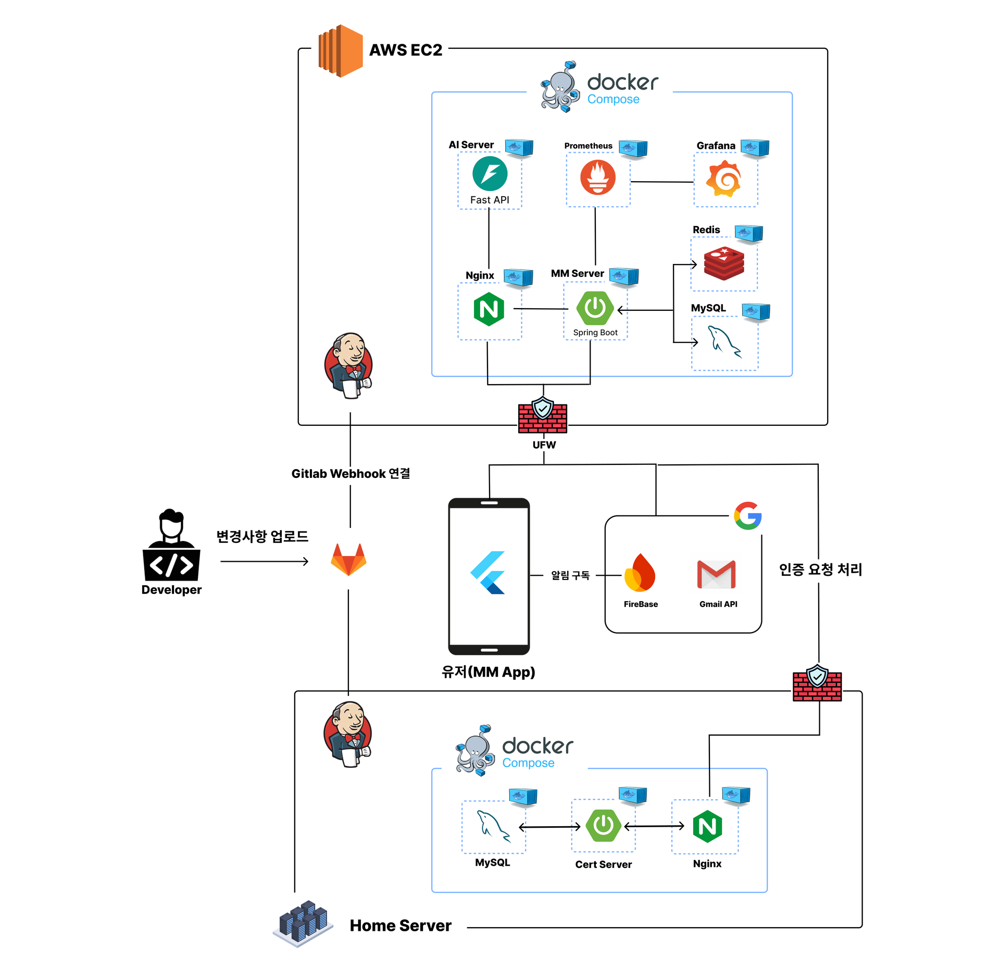
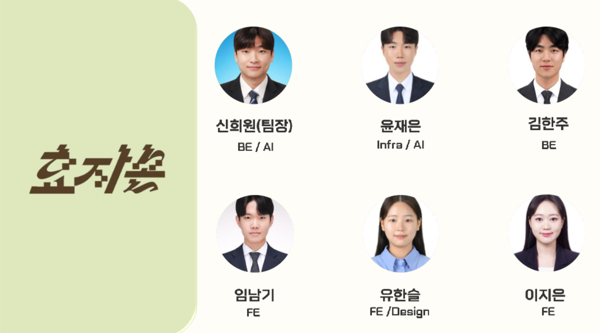

# 🍡 MM (Marsh Mellow)  
### 사회초년생 맞춤형 예산 관리 핀테크 플랫폼

> 💬 “한 달 예산을 체계적으로 관리하고 싶은데, 방법을 모르겠어요!”

🙋‍♀️🙋‍♂️ **사회초년생**이 쉽고 재미있게 예산을 관리할 수 있도록 도와주는  
💡 **개인 맞춤형 재정관리 앱**, 바로 **MM**을 소개합니다!

✨ AI 기반 예산 분배부터  
📊 소비 유형 분석,  
🎯 목표 저축 기능까지 한 번에!

---

## 📌 팀명: GBH (효자손: Good Boy Hand)  
## 💡 프로젝트명: MM (Marsh Mellow)

---

## 🧩 프로젝트 개요

### 🎯 기획 배경
- 청년층의 재정 위기는 점점 심각해지고 있으며, 평균 대출액은 8,000만 원에 달합니다.
- 20대 4명 중 1명은 한 달 저축을 전혀 하지 못하고 있습니다.
- 예산 관리는 하고 싶지만, 방법을 몰라 포기하는 사회초년생이 많습니다.

### 🎯 기획 의도
- 사용자의 소비/자산 데이터를 바탕으로 **자동 예산 분배**와 **자동 저축 기능** 제공
- 재미있는 UI/UX와 캐릭터를 통해 스트레스 없는 재정 관리
- 누구나 앱 설치와 간단한 가입만으로 예산 관리를 시작할 수 있음

### 🎯 프로젝트 목적
> **사회초년생의 재정 관리를 효율적으로 지원하는 것**  
급여 수령 후 자동화된 예산 분배를 통해 재정적 안정과 경제적 자립을 유도합니다.

---

<table>
  <thead>
    <tr>
      <th align="center">기능 이름</th>
      <th align="center">기능 설명</th>
      <th colspan="2" align="center">Screenshots</th>
    </tr>
  </thead>
  <tbody>
    <tr>
      <td align="center"><strong>① 통장 응원단</strong></td>
      <td align="center">
        <strong><em>귀여운 캐릭터가 나의 재정생활을 함께해줘요!</em></strong>  
        - 월급 입금 시 캐릭터 등장 및 축하 알림 제공 
        - 소비 유형 기반 예산 자동 분배 추천 
        - 데일리 예산 및 초과 시 실시간 지출 알림 제공
      </td>
      <td></td>
      <td></td>
    </tr>
    <tr>
      <td align="center"><strong>② 자산 관리단</strong></td>
      <td align="center">
        <strong><em>자산을 한눈에 보고 분석까지!</em></strong>  
        - 직관적인 자산 현황 시각화 및 리포트 
        - 자산 간편 조회 기능으로 빠른 확인 
        - 송금 기능으로 Marsh Mellow에서 간편 송금!
      </td>
      <td></td>
      <td></td>
      <td></td>
    </tr>
    <tr>
      <td align="center"><strong>③ 가계부 매니저</strong></td>
      <td align="center">
        <strong><em>AI가 도와주는 똑똑한 지출 관리</em></strong>  
        - AI 기반 카테고리 자동 분류 
        - 월별 지출 패턴 분석 
        - 검색 필터링 기능 제공
      </td>
      <td></td>
      <td></td>
    </tr>
    <tr>
      <td align="center"><strong>④ 점메추 / 퇴사 망상록 / 포트폴리오</strong></td>
      <td align="center">
        <strong><em>일상과 커리어도 함께 챙겨요!</em></strong>  
        - 점심 메뉴 추천으로 결정장애 해결 
        - 퇴사 시뮬레이션으로 스트레스 해소 
        - 커리어 포트폴리오 정리로 성장 추적
      </td>
      <td></td>
      <td></td>
      <td></td>
    </tr>
  </tbody>
</table>

---

## 📊 시장 분석

### 💰 시장 트렌드
- **PFM(Personal Finance Management) 시장** 성장 중
- Z세대 중심의 **데이터 기반 맞춤형 핀테크 서비스** 선호 증가
- **급여 기반 금융 서비스** 수요 증가

### 🎯 타겟 사용자
- Z세대 및 사회초년생
- 재정관리를 처음 접하는 20~30대 직장인

### 🔍 경쟁사와의 차별점

| 🧩 항목            | 🏢 기존 앱 특징                        | 🚀 **MM(우리 앱)**                            |
|--------------------|----------------------------------------|-----------------------------------------------|
| 💰 **예산 설정**     | ✍️ 수동 입력                          | 🤖 **AI 기반 자동 예산 분배** |
| 🔔 **예산 초과 알림** | ⚠️ 제한적 or 미지원                   | 📊 **지출 비율 알림으로 과지출 예방**        |
| 🎨 **UI / UX**       | 😐 딱딱하고 지루한 화면 구성          | 🧸 **캐릭터 기반 + 직관적 인터페이스**       |
| 🎁 **위시리스트 관리** | 📝 미지원 or 단순 메모 기능           | ✨ **자동/수동 등록 + 목표 기반 자동 저축**  |

## 🛠 기술 스택 및 아키텍처
### 🎨 Frontend

   

### ⚙️ Backend

      

### 🗄 Infra

         

### 🗃️ Database

   

### 🧠 AI

    

### 🏗 시스템 아키텍처

---

## 👥 팀 소개

## 👨‍👩‍👧‍👦 GBH (효자손)

> 💼 **"젊은 세대를 위한 실질적인 재정 도우미를 만들고자 하는 팀"**

🔥 **GBH**, 당신의 경제적 독립을 위한  
든든한 **재정 파트너**가 되어드립니다!

| 이름 | 역할 | 담당 업무 |
|------|------|-----------|
| **신희원** | Back-End / AI | - 🧮 예산 및 위시리스트 API 구현 - 🧠 AI 모델 개발 (카테고리 분류, 소비 유형 분석) - 🔔 FCM 기반 알림 로직 구현 |
| **윤재은** | Infra / Back-End | - 💰 자산, 가계부, 포트폴리오 API 구현 - 🔧 CI/CD 파이프라인 구축 (MM, 인증, AI 모듈 배포) |
| **김한주** | Back-End Leader | - 👤 회원 및 인증 API, 📝 퇴사망상록 기능 개발 - 🔐 RSA 및 SHA-512 기반 전자서명 검증 로직 구현 |
| **임남기** | Front-End Leader | - 💳 자산 관련 UI/UX 설계 및 API 연동 - 🍱 점심 메뉴 추천 기능 구현 - 🛡️ AES 기반 금융데이터 암호화 로직 구축 |
| **유한슬** | Front-End / Designer | - 📝 회원가입, 예산, 위시리스트 UI/UX 및 API 연동 - 🔑 RSA 키 페어 생성 및 암호화 로직 구현 - 🔍 소비 유형 분석 모델 연동 |
| **이지은** | Front-End / Designer | - 📒 가계부, 포트폴리오, 퇴사망상록 UI/UX 및 API 연동 - 🧾 소비 카테고리 분류 모델 연동 - 📱 위젯 UI / UX |
 

---

## 📎 참고자료

- [사회초년생 "월급보다 지출 더 많아"...2030 재정상태 '심각'](https://www.greened.kr/news/articleView.html?idxno=54202)
- [MZ 스마트경제 - 대출과 연체 증가](https://m.segyebiz.com/newsView/20240903510174)
- [한국일보 - 평균 대출 8100만원](https://www.hankookilbo.com/News/Read/A2024101411080001569)
- [20대 4명 중 1명 "저축, 한 달에 한 푼도 못한다"](https://www.chosun.com/site/data/html_dir/2019/08/09/2019080901888.html)

---

## 📌 기타

> 본 프로젝트는 청년 재정교육과 소비 개선을 목표로 합니다.  

### 추후 추가 내용 

- AI 모델 소개(카테고리 분류 모델, 소비패턴 유형 분석)
- 인증서, 데이터 암호화 및 보안 로직 추가가