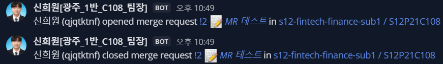

# 신희원 학습일지
### 03-04 깃랩 MM 연동
1. default branch(develop 변동시 MM 알림)
2. 테스트 용으로 docs push 후 MR 요청 해볼게요.

- MR 및 취소

- MM 반응

- 내일 할 일
    1. 깃랩 지라 연동
    2. 아이디어 기획획

### 03-05 싸피 금융망 API 학습
#### 싸피 금융망 사용 이유
1. 실제 은행사 API는 사용 비용이 있다.
2. 실제 은행의 데이터를 사용하면 개발 중 사용자 정보 유출 위험이 있다.
3. 복잡한 인증 절차를 걸치지 않고 실제 은행 서비스를 이용할 수 있다.(ID만 필요)
#### 싸피 금융망 적용 방식
- 금융앱에서 금융서비스를 사용하기 위해 금융인증서 발급 -> 우리 서비스에서 SSAFY 로그인을 통해 받은 userKey로 대체
- 싸피 금융망에서 얻은 마이데이터(자산), 우리 서비스의 회원 정보(직종, 예산, 나이) 데이터를 JOIN 후 예산 분배

#### 문제점
아직 SSAFY 금융망이 열리지 않아 실제 동작과정을 알 수 없다.