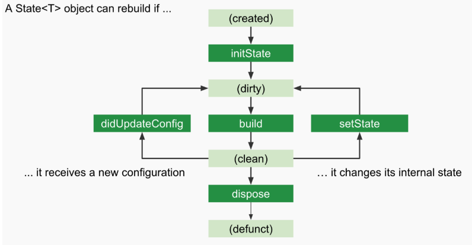

# 03/04
## flutter 학습

### Flutter의 UI 아키텍처는 다음의 세 계층으로 구성된다.
1. Widgets  
  위젯은 UI의 "청사진" 이다. 위젯은 불변 객체이며, 개발자가 UI의 상태를 기술하는 선언적 도구이다. 위젯은 단순히 화면에 무엇을 보여줄지 기술할 뿐, 직접적으로 화면을 그리는 역할은 하지 않는다.
2. Elements  
  엘리멘트는 위젯과 렌더 오브젝트 사이의 다리 역할을 한다. 엘리먼트는 위젯 인스턴스를 실제 트리 상의 "노드"로 변환하며, 해당 위치에 어떤 렌더 오브젝트가 연결되어 있는지를 관리한다. 이 과정에서 엘리먼트는 위젯 트리와 렌더 트리 간의 비교(diffing) 작업을 수행한다.
3. Render Objects  
  렌더 오브젝트는 실제 화면에 그려지는 "실체" 이다. 이들은 레이아웃, 페인팅, 히트 테스트 등 UI의 물리적 특성을 관리하며, 상대적으로 무거운 객체이다. 성능 최적화를 위해 렌더 오브젝트는 가능한 재사용된다.

### Linear reconciliation

선언형 UI 프레임워크 특성상 UI 변화가 있으면 그 부분만 콕 집어서 UI를 다시 그려내는 것이 성능상 굉장히 중요하다. Flutter는 이 부분을 Elements가 수행하는 Diffing 작업이 담당하고 있다.

*무엇인가 위젯에 변경사항이 있는 해당 위젯은 dirty flag가 꽂히고 이를 다시 build 해서 clean 상태로 바꾼다.*

1. dirty가 된 위젯들을 모두 List에 저장해둔다.
2. dirty list 에 있는 위젯은 다시 새로운 위젯으로 만들어내고 기존 Element와 비교한다.
3. 만약 동일(타입과 key가 같다면)하면 Element.update()를 호출하여 속성만 업데이트하고, 하위 clean 영역은 조기 종료(Early Exit)로 처리한다.
4. 동일하지 않으면 기존 Element를 폐기하고 새 Element를 생성한다.   

# 03/05
## flutter 학습
### Reconcilition 재조정
공식문서에서는 기존 elment tree와 dirty 위젯을 새로만든 위젯과 비교하는 구간이 있는데 이를 재조정이라고 소개한다.

만약 기존 엘리먼트의 위젯과 새 위젯이 동일한 타입과 key를 공유한다면, 해당 엘리먼트는 재사용되며 Element.update() 메서드를 통해 새로운 속성값들이 렌더 오브젝트에 반영된다. 반면, 타입이나 key가 일치하지 않는 경우에는 기존 엘리먼트가 제거되고 새롭게 Element가 생성되어 트리에 삽입된다.

reconciliation 과정이 이루어진 이후 결과를 토대로 렌더 오브젝트는 레이아웃과 페인팅의 무거운 작업을 담당한다. 이들은 생성 비용이 크므로 diffing 결과를 토대로 다음과 같이 최적화를 수행.
- 유형 일치 검사 : 동일한 위젯 타입이 존재할 경우, 기존 렌더 오브젝트를 그대로 재사용, 변경된 속성만 업데이트. 불필요한 렌터 트리 재구성 방지.
- 상태 보존 : StatefulWidget의 경우, 위젯이 다시 생성되더라도 내부의 state 객체는 엘리먼트에 의해 유지. 사용자가 입력한 값이나 애니메이션 상태 등은 계속 보존되며, 변경된 부분만 다시 반영. 

> 즉 플러터의 3계층 Widgets, Element, RenderObject에서 각각 UI 최적화 작업이 이루어지고 있으며 위젯의 생명주기를 담당하는 Element가 특히 더 중추적 역할을 수행.

*위젯은 그려질때 변화점을 Reconciliation 방식을 통해 최적화 작업을 수행합니다. 이러한 최적화 과정 속에서 플러터는 변경된 위젯만 콕 찝어 다시 그려내게 됩니다!*   

# 03/06
## 도메인 학습
### SUPER APP
모바일이 주가 되는 세상 속에서 다양한 어플리케이션들이 쏟아지면서 여기저기 앱을 옮겨 다녀야 하는 경우가 많다.

이를 보완해주는 어플리케이션 트렌드, 슈퍼앱

> 단일 플랫폼 내에 라이프 스타일의 전반적인 서비스를 제공하는 어플리케이션

1. 번거로운 절차의 생략
  서비스를 이용하기 위해 필요했던 수많은 절차 생략
  사용자 입장 : 편의성 상승, 만족도 증가

2. 락인 효과
  사용자가 이탈하지 않고 계속해서 같은 제품, 서비스를 이용하게끔 가둬 두는 것
  기업 입장 : 다른 기업에서 더 뛰어난 제품, 서비스를 출시해도 이미 사용하고 있는 서비스나 함께 제공되던 혜택 등에 대한 기회비용으로 인해 옮겨가지 못하게 붙잡아 두는 개념

### 초개인화 hyper personalization
  > 단순히 한 개인의 정보를 넘어서 실시간 행동 패턴과 같은 훨씬 더 복잡한 데이터를 정교한 알고리즘과 고도화된 기술력을 통해 분석해냄으로써 시간, 장소, 상황에 따른 니즈를 정확하게 파악하여 적시에 서비스를 제공

  - 클라우드 컴퓨팅  
    방대한 양의 데이터를 저장하고 실시간으로 접근할 수 있게 하여, 기업이 빠르게 데이터를 처리하고 분석할 수 있도록 돕는다.
  - 빅데이터 분석  
    고객의 구매 이력, 검색 기록, 소셜 미디어 활동 등을 종합적으로 분석하여 유의미한 패턴과 통찰을 도출.  
    이를 통해 기업은 고객의 선호와 필요를 정확히 파악하고, 그에 맞는 맞춤형 서비스를 제공.
  - AI, 머신러닝
    초개인화 서비스의 핵심 기술, 데이터 분석과 예측 모델링을 가능하게 함. 고객의 행동 패턴을 학습하고 이를 기반으로 미래의 행동을 예측. 
