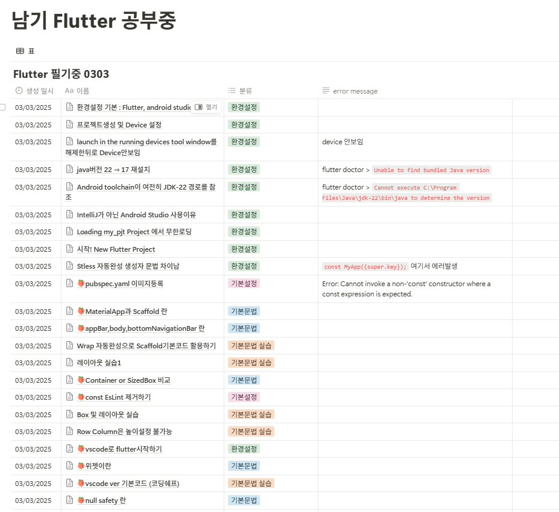
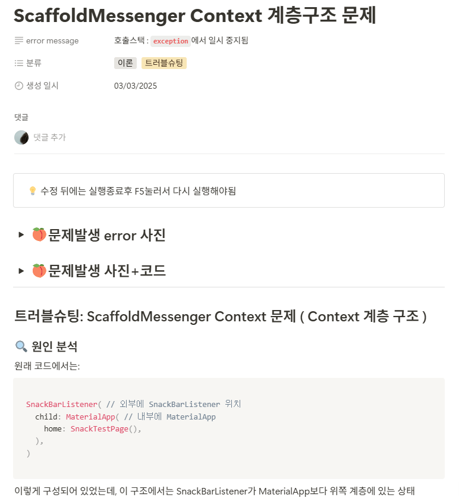

# 🤓1 사전 도메인 공부

내용 보기

## 😮1.1 갤럭시 워치 사용가능 기술

> 삼성이 공식적으로 제공하는 개발자 접근 가능 API만 사용할 수 있다.
> 
1. **알림 관련 API**
2. **타일/위젯 API :** 빠른 정보 확인용 인터페이스 제작
3. **입력 처리 API :** 터치, 제스처, 버튼 입력, 음성 명령(stt)
4. ⭐**센서 데이터 접근 API**
    - ⭐가속도 센서, 가속도, 자이로, 기압, 조도, 심박수
    - 실시간 및 히스토리 데이터 모두 접근 가능
5. 🆘**피트니스/건강 데이터 접근 API `Kotlin`**
    - 🆘 심전도, 체온, 산소포화도 호출
    - 운동 기록, 칼로리 소모량, 활동 패턴 등
    - Health Connect API나 Samsung Health API 통해 접근

## 😮1.2 핀테크 기술정리

### 🍑1.2.1 `PG사 API` 개념정리

- **정의**: 온라인 결제를 위한 기술적 기반과 금융기관 연결을 제공하는 회사
- **예시**: 토스페이먼츠(구 LG유플러스), KG이니시스, 나이스페이먼츠 등
- **핵심 가치**: 기술적 연결성 (다양한 결제수단 통합)
- **다중 결제수단 지원**: 토스페이먼츠 같은 PG사는 거의 모든 국내 카드사, 은행계좌, 간편결제 등을 지원함
- **통합 인터페이스**: 개발자는 하나의 API로 다양한 결제수단 사용 가능
- **자금 흐름**:
    - 고객 → (카드사/은행) → PG사 → 판매자 계좌
- 실제 예시:
    - 앱에서 결제 요청 시 토스페이먼츠 API 호출
    - 사용자가 KB국민카드로 결제 선택
    - 토스페이먼츠가 KB카드사와 통신하여 결제 처리
    - 결제 완료 후 판매자에게 통보
    - 정산일에 판매자 계좌로 금액 입금
- PG사 API로 가능한 것들
    - **다양한 은행/카드사 결제**: 신한, 국민, 우리 등 모든 은행 및 카드 결제 가능
    - **간편결제 수단**: 네이버페이, 카카오페이, 삼성페이 등 통합 지원
    - **해외카드 결제**: VISA, MasterCard 등 해외카드 결제도 가능
    - **가상계좌 발급**: 일회성 입금용 가상계좌 발급 가능

### 🍑1.2.2 `간편결제` 개념정리

- **정의**: 사용자의 결제 정보(카드, 계좌)를 미리 등록해두고 비밀번호나 생체인증으로 쉽게 결제할 수 있는 서비스
- **예시**: 네이버페이, 카카오페이, 삼성페이, 토스 간편결제 등
- **핵심 가치**: 편의성 (복잡한 결제 과정 생략)
1. **간편결제 서비스도 PG 기능 구현**:
    - 카카오페이는 자체 PG 기능을 갖추고 있음
    - 네이버페이는 자체 PG 기능 + 외부 PG사 병행
2. **대기업의 사업 확장**:
    - 토스는 '토스 간편결제'(간편결제 서비스)와 '토스페이먼츠'(PG사)를 모두 운영
    - 네이버도 네이버페이(간편결제)와 네이버파이낸셜(금융 서비스)을 운영
3. **기술적 구현 방식**:
    - 간편결제 서비스들은 내부적으로 PG사 기능을 사용하거나 외부 PG사와 제휴
    - 앱 개발자 입장에서는 둘 다 API로 연동한다는 점은 비슷

> 개발 시 일반적으로 먼저 PG사 연동을 구현하고, 그 위에 간편결제 옵션을 추가하는 방식으로 진행함. 예를 들어 토스페이먼츠 API를 연동하면 그 안에서 카카오페이, 네이버페이 등의 간편결제 옵션을 함께 제공받을 수 있음.
> 
- 토스페이먼츠 API로 카카오페이 결제시 구조
    - **단일 PG 사용**: 토스페이먼츠 PG만 사용함. 카카오페이는 여기서 '결제수단'으로 취급됨
    - **서비스 흐름**:
        1. 앱 → 토스페이먼츠 API 호출
        2. 토스페이먼츠 → 결제창에 카카오페이 옵션 표시
        3. 사용자가 카카오페이 선택
        4. 토스페이먼츠 → 카카오페이와 연동된 결제 진행
        5. 결제 완료 후 → 토스페이먼츠가 앱에 결과 전달

### 🍑1.2.3 `PG사 API` 그리고 `다중은행 계좌 간 송금`의 차이점

- **용도의 차이**:
    - **PG사 API**: 주로 상품/서비스 구매를 위한 결제 처리용
    - **다중은행 계좌 간 송금**: 개인 간 또는 기업 간 단순 자금 이체용
- **프로세스 차이**:
    - **PG사 결제**: 구매자 → PG사 → 판매자 (판매자는 정산을 받음)
    - **계좌 간 송금**: 송금자 → 수취인 (직접 이체)
- **정산 차이**:
    - **PG사**: 일정 주기로 정산 (일괄 처리)
    - **계좌 송금**: 즉시 이체 (실시간 처리)

### 🍑1.2.4 핀테크 기술 난이도 정리

#### 🥑기본🥑

- 결제 API
    - PG사 API 연동 (토스) : 구매자 → PG사 → 판매자 (판매자는 정산을 받음)
    - 결제프로세스 : 결제요청, 승인, 취소
    - 간단한 QR코드 결제 시스템
- 예산 관리 도구
    - 기부금 세금공제 계산기

#### 🥑중간🥑

- 다중은행 계좌 간 송금
    - 
- 간편결제
    - 생체인식 결제 연동
    - 원터치 결제 구현
    - 정기결제/구독형 기부
- 오픈뱅킹 API
    - 계좌 연결 및 잔액 조회
    - 계좌이체 기능
- 가상계좌 발급
    - 기부금 모금을 위한 가상계좌
    - 기부금 입금 확인 자동화
    - 기부금 정산 프로세스
- 금융데이터 연동
    - 신용정보 조회 연동
    - 소득/지출, 카드사용내역 등 분석 및 기부 추천

#### 🥑하드코어🥑

- 다중인증 MFA 구현
    - **개념**: 두 가지 이상의 서로 다른 인증 수단을 조합해 보안을 강화하는 방식
    - **구현 방법**:
        - 지식 기반(비밀번호) + 소유 기반(OTP/인증앱) + 생체 기반(지문/얼굴) 조합
        - Flutter에서는 local_auth 패키지로 생체인증, otp 패키지로 일회용 코드 구현 가능
    - **실제 예**: 카카오뱅크 로그인 시 비밀번호 입력 후 지문/패턴 추가 인증
- 전자서명 및 암호화 처리
    - **개념**: 디지털 환경에서 문서/거래의 진위성과 무결성을 보장하는 기술
    - **구현 방법**:
        - 공개키/개인키 기반 RSA, ECC 암호화 알고리즘 활용
        - Flutter에서 pointycastle, encrypt 패키지로 구현 가능
        - 중요 데이터 전송 시 end-to-end 암호화 적용
    - **실제 예**: 전자계약서 서명, 인증서 기반 뱅킹 로그인, 중요 금융정보 암호화
- FDS 이상거래 탐지 시스템
    - **개념**: 비정상적인 금융 거래 패턴을 실시간으로 감지하여 사기/도용 방지
    - **구현 방법**:
        - 사용자 행동 패턴 분석 (위치, 시간, 금액, 빈도 등)
        - 머신러닝 알고리즘으로 이상치 탐지
        - 위험 점수(Risk Score) 기반 알림/차단 시스템
    - **실제 예**: 평소와 다른 지역에서 고액 결제 시도할 때 추가 인증 요구
- KYC 고객확인제도 프로세스
    - **개념**: 금융 서비스 이용자의 신원을 확인하고 검증하는 법적 의무 절차
    - **구현 방법**:
        - 신분증 진위 확인 (OCR + 진위확인 API)
        - 얼굴 인식 대조 (본인/신분증 일치 여부)
        - 실명계좌 인증 (소액이체 검증)
    - **실제 예**: 토스 가입 시 신분증 촬영 및 실명 계좌 인증 과정
- ~~AML 자금세탁방지 모니터링~~
- ~~법적 컴플라이언스 자동화~~
- ~~블록체인기반 NFT 기부 증명서 발급~~
- ~~블록체인기반 스마트 컨트랙트 기부 자동화~~

# 🤓2 사전 Front-end 공부

# 🤓3. 아이디어 기획

 아이디어 기획 내용 보기

해상 안전 + 보험 원스톱 서비스

## 😮3.1 해상안전 + 보험 원스톱서비스

### 1. 🍉서비스 개요

해양 활동 시 **안전**을 최우선으로 고려하며 보험 및 **응급상황** 대응을 통합적으로 제공하는 **핀테크** 서비스. 

사용자가 해양 활동 전 **안전체크리스트** 작성부터 실시간 **기상정보 확인**, 간편 **보험** 가입, **사고 발생** 시 신속한 대응까지 원스톱으로 제공함.

### 2. 🍉핵심 가치

1. **안전성** - 사전 체크리스트와 실시간 정보로 안전한 해양활동 지원
2. **편의성** - 복잡한 해양정보와 보험가입 절차를 간소화
3. **신속성** - 응급상황 발생 시 빠른 대응과 구조 요청 지원
4. **맞춤형** - 활동 유형과 지역에 따른 맞춤형 정보 제공

### 3. 🍉타겟 사용자

- 낚시꾼
- 해양 레저스포츠 참여자 (서핑, 스쿠버다이빙, 요트 등)
- 해안가 활동 참여자

### 🍇해상 안전체크리스트 작성 기능

- 활동별 맞춤형 안전체크리스트 제공
- 안전수칙 준수 인증 및 활동 로그 기록

### 🍇정보 제공 기능

- 🥑API
    - **기상청 오픈 API**
        - 해상특보 API (실시간 기상 경보/주의보)
        - 해양기상부이 관측 API (실시간 해상 상태)
        - 레이더영상 API (기상 상황 시각화)
    - **국립해양조사원 API**
        - 조위 관측소 API (조석표/물때 정보)
        - 해양관측 API (종합적인 해양 상태)
    - **카카오맵 API** 또는 **네이버맵 API**
        - 지도 시각화 및 위치 기반 서비스
        - 하나만 선택해도 충분함
    - **해양경찰청 API**
        - 해상구조함정 위치정보 API (실시간 구조함정 위치)
- 실시간 해상특보, 조석표, 날씨 통합 대시보드
- 위치 기반 해역별 위험도 평가 및 예측
- 사용자 맞춤형 기상경보 및 주의보 알림
- 해상 통신 가능 구역/불가 구역 지도 제공

### 🍇보험 기능

- 🥑API
    - **토스페이먼츠 API**
        - 결제 처리 (보험료 결제)
        - 가상계좌 발급 및 관리
    - **인슈어테크 플랫폼 API** (레몬클립 등)
        - 보험 상품 정보 및 가입 연동
        - 대안: 특정 보험사 1-2곳과 직접 제휴
    - **오픈뱅킹 API**
        - 계좌 조회 및 관리 (보험금 수령 계좌)
- 활동별 일일 안전보험 간편 가입/결제
- 보험료 자동결제 및 가상계좌 활용 정산 시스템 (어려울듯)
- 실시간 보험 가입 내역 확인
- 보험금 청구 간소화 프로세스 (앱 내 청구서 작성)

### 🍇사고 신고 기능

- 🥑API
    - **해양경찰청 API** 또는 **119 안전센터 API**
        - 신고 접수 연동 (가능한 경우)
        - 대안: 자동 신고는 어려울 수 있으므로 신고 정보 구성 후 전화 연결
    - **카카오맵 API** 또는 **네이버맵 API**
        - 위치 추적 및 공유
        - 구조함정/안전시설 위치 표시
- 갤럭시워치 센서 기반 낙수 감지
- 사고 발생시 가까운 해경/보험사 동시 신고
- 사고 발생시 핸드폰에서 실시간 구조함정위치, 응급처치 가이드 제공
- 최종 위치 및 동선 자동 전송 기능
- SOS 신호 발생 시 등록된 비상연락처 자동 알림
- 오작동 방지를 위한 취소 타이머 설정
- 음성 기록 자동 전송 (사고 상황 음성 녹음)

### 이하 생략

DearDays

## 😮3.2 DearDays 소중한 순간을 더 소중하게

### 프로젝트 개요

소중한 사람들과의 특별한 순간을 기억하고, 더 따뜻하게 나눌 수 있도록.
DearDays는 기념일과 경조사를 자동으로 관리하고, 적절한 선물과 송금까지 간편하게 도와주는 서비스입니다.

현대 한국인들은 다양한 기념일과 경조사에서 선물과 축의금을 주고받지만, 이를 효율적으로 관리할 통합 시스템이 부재하다. 
수기장부나 분산된 앱 사용으로 인한 불편함이 존재하며, 특히 웨어러블 기기를 활용한 경조사 관리 솔루션이 미흡한 상황이다.

• 기념일 정보는 연락처나 SNS에, 경조사비 내역은 수기장부나 엑셀에, 송금은 금융앱에서 별도로 관리되어 통합적 관리가 어려움
• 중요 기념일 알림 시스템 부재
• 여러 경조사가 겹칠 경우 예산 관리가 어려움
• 그룹 선물/경조사 정산의 번거로움:
• 누구에게 얼마를 주고받았는지, 어떤 선물을 교환했는지 장기적으로 관리하기 어려움
• 웨어러블 기기 활용 부족: 스마트워치의 알림, 간편 결제 등 기능을 경조사 관리에 효과적으로 활용하는 서비스 부재

### 서비스 기능

연락처 연동 : 연락처로부터 지인 정보 가져오기 ( Flutter contacts_service )

소셜연동: 인스타그램/페이스북 친구 기념일,경조사 자동 가져오기

• 내가 준 선물(돈) 기록 및 관리 (쿠팡공유 > deardays > 자동기록 )

• 내가 받은 선물(돈) 기록 및 관리 

• 나의 위시리스트 관리 및 크라우드펀딩 내역 관리

• ✨[AI] 경조사 장부(엑셀, 수기작성) 데이터화 해서 관리

• ✨[AI] 지출 통계/분석

• ✨[AI] 선물 추천 (앱가입친구가 지출한 선물 및 SNS기반 선물 추천)

• ✨[AI] 지출 카테고리화

• ✨[AI] 관계별 적정 예산 가이드 (연락빈도 및 지인그룹화 기반 적정예산 추천)

• 지출 한도 설정

• 경조사 일정 공유

• 디지털 감사장/초대장 (카톡으로도 가능)

• 지인 그룹화해서 관리

• ✨[AI]영수증 스캔 저장 - 경조사비 지출 증빙자료 자동 인식 저장 (세금정산용)

• 중복 선물 방지 - 다른유저가 준 선물은 방지해주기

• 홈화면 위젯에서의 중요기념일 표시해주기

• 가족 계정 - 가족끼리 공유하는 기념일 관리 기능

• 💶[송금] PG사API계좌이체, QR코드 송금, 간편송금

• 💶[송금] 다중은행 간 송금

• 💶[자동송금] 자동 송금 예약 기능

• 💶[가상계좌 + 정산] 그룹 모금 기능 (다같이 돈모아서 선물)
    ◦ [어려움]  (카카오톡 모임통장, 토스 모임통장)

### 이하 생략

오늘의 꾸역꾸역 (초안작성) 

## 😮3.3 오늘의 꾸역꾸역 (초안 작성)

### 프로젝트 배경

사회 초년생들은 직장 생활에 적응하는 과정에서 다양한 어려움을 겪습니다. 특히, 첫 급여를 효율적으로 관리하는 방법에 대한 정보가 부족하며, 직장 내 소통과 스트레스 관리 등 여러 가지 도전에 직면합니다. 이에 따라, 초년생 직장인들이 안정적으로 사회생활을 시작할 수 있도록 지원이 필요합니다.

### 언급되지 못했던 서브기능

## ▫️Sub 기능

1. 🍑**오늘의 버티기** - 하루하루 회사 버티는 직장인들 응원 앱. 출근 체크하면 하루 버티기 시작, 퇴근하면 클리어! 연속 출근일수, 버티기 레벨업, 위로의 한마디 공유방 제공.
    1. **오늘의 꾸역꾸역** - 직장인들의 사소한 성취 공유방. 지각 안한 날, 메일 다 비운 날, 쓸데없는 회의 견뎌낸 날 등 작은 성공에 서로 격려.
    2. **[위젯] 몇분지났어?** - 몇분냥이 클릭시 “출근한지 1시간이나 지났어! 너 방금 2만4천원 번거야! yaho 1 뿌링클” 알려주는 기능
2. 🍑**야근 타이쿤** - 야근할 때마다 포인트 쌓이는 기능. "오늘 야근 3시간 = 가상 휴가 2일" 같은 보상 시스템으로 위로받음.
    1. **퇴근 타임캡슐** - 출근길에 오늘 퇴근 후 하고싶은 것 기록하면, 퇴근시간에 알림으로 상기시켜주는 앱. 하루종일 이것만 생각하며 버티게 해줌.
    2. **[위젯] 퇴근시간 복돌이** - 배경화면 위젯에서 퇴근시간 카운트다운 해주는 복돌이 캐릭터. 야근하면 복돌이가 졸고, 정시 퇴근하면 신나서 뛰어노는 애니메이션.
3. 🍑**상사어 번역기** - 상사가 하는 말 해석해주는 유머 앱. "가능한 빨리 = 당장", "검토해볼게요 = 거절" 같은 번역 사전. 직장 용어 번역 사전도 같이 제공.
    1. **회사생활 도감** - 직장에서 만나는 다양한 캐릭터들 도감 수집. "부장님 앞에서 실수했다" "프린터 종이 걸렸는데 아무도 몰래 떠남" 같은 이벤트 수집하면 위로 포인트 제공.
    2. **~~회사생활 빙고판** - 신입 필수경험 빙고판 제공. "처음으로 보고서 망함", "회의에서 존재감 없었음", "부장님 취향 파악함" 같은 항목들. 빙고 달성하면 선임들 응원 메시지 받음.~~

---

## ▫️SubSub 기능

1. 🍑**월요병 처방전** - 월요일마다 특별히 활성화되는 기능. 월요병 증상 체크리스트, 맞춤형 응원 메시지, 월요일 견디는 꿀팁 공유, 커피 쿠폰 랜덤 증정 이벤트.
2. 🍑**쫄보 경비원** - 회사 깜깜한 주차장 혼자 나갈 때 무서운 사람 위한 앱. 귀여운 경비원 캐릭터가 함께 걸어가주고 응원해주는 효과음 제공.
3. 🍑**타임캡슐 메시지** - 입사 첫날 자신에게 보내는 메시지 작성하면, 하루하루가 1년 같기때문에 다음날 바로 타임캡슐 오픈. 성장과정 되돌아보는 계기 제공.
4. 🍑**스피드 회식탈출** - 급한 약속있는척 전화오게 하는 기능. 맞춤형 변명 스크립트 제공, 탈출 타이머 설정, 동료들과 탈출 시그널 공유 가능.

---

## ▫️버려진 기능

1. **커피 모아요** - 매일 마시는 커피 기록하면 포인트 주는 앱. 포인트로 귀여운 텀블러, 머그컵 아이템 모으기. 실제 할인 쿠폰도 가끔 줌!
2. **점심룰렛** - 회사 주변 점심메뉴 고민 해결해주는 랜덤 추천 앱. 메뉴 룰렛, 가격대별 추천, 동료들이랑 투표 기능, 식사권/쿠폰 모으기 기능도 있으면 재밌을듯.
3. **출근룩 코디** - 아침마다 뭐입지 고민 끝! 날씨 기반 코디 추천, 내 옷장 사진 등록해서 조합 추천, 직장인들 OOTD 공유방.
4. **티끌모아** - 커피 한잔 아끼면 뭐가 될까? 매일 소소한 절약 습관으로 모으는 재테크 앱. 이번달엔 해외여행 티켓 살 수 있다! 같은 목표 설정.
5. **퇴근시간** - 퇴근 카운트다운 + 오늘 뭐하고 놀지 추천. 운동, 전시, 맛집, 홈술 등 맞춤형 퇴근 후 액티비티 제안.
6. **직장생활 빙고** - 회사에서 겪는 웃긴 상황들 빙고판으로 만들어서 공유. "상사가 내 이름 틀림", "회의실 예약 겹침", "프린터 종이 없음" 같은 직장생활 에피소드 소통.

1. **랜덤커피챌린지** - 회사 내 다른 부서 사람들과 자동으로 커피타임 매칭해주는 앱. 인맥 넓히기 좋고 회사생활 꿀팁도 얻을 수 있음.
2. **미팅룸 헌터** - 회의실 없어서 헤매는 문제 해결! 실시간 빈 회의실 찾기, 살짝 훔쳐보기 기능(누가 언제까지 쓰는지), 몰래 예약 기능까지.
3. **밥친구 매칭** - 혼밥 싫은 사람들 연결해주는 앱. 회사 근처에서 같이 밥먹을 사람 실시간 찾기, 관심사 기반 매칭, 새로운 맛집 탐방팀 결성.
4. **출근길 버스메이트** - 같은 버스/지하철 타는 직장인들 커뮤니티. 자리양보, 지연정보 공유, 출퇴근길 심심할 때 익명 채팅.
5. **오피스 플레이리스트** - 상황별 직장 bgm 추천 앱. "상사 깨진 날" "야근 확정" "퇴근 30분전" 같은 테마별 음악 추천.

