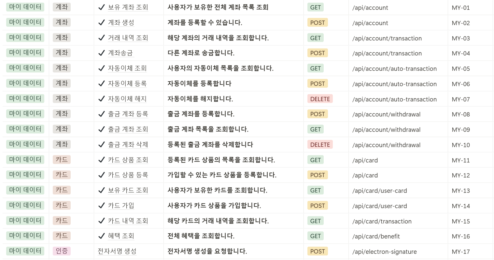
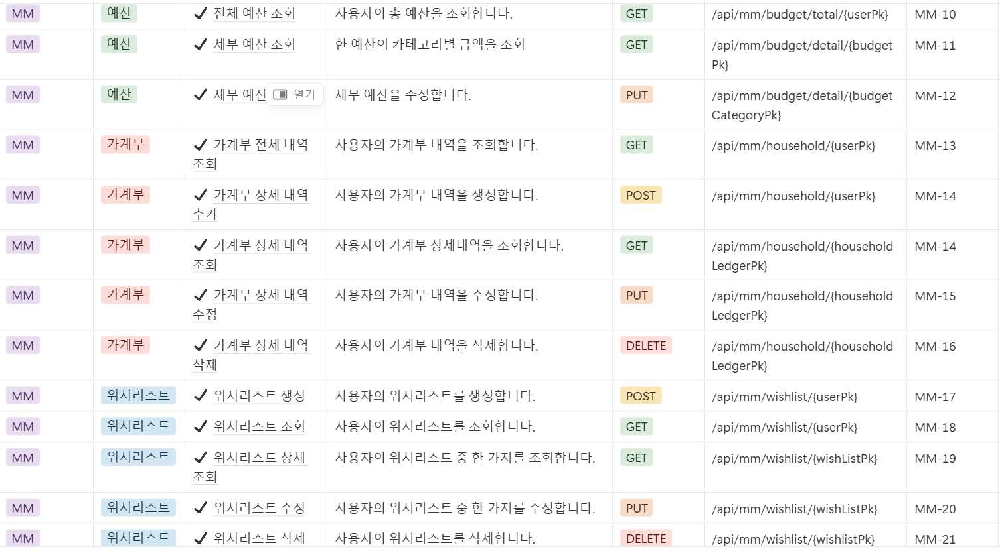
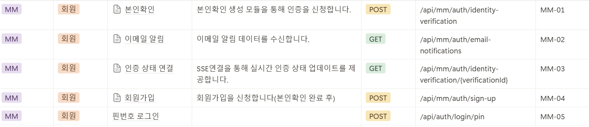
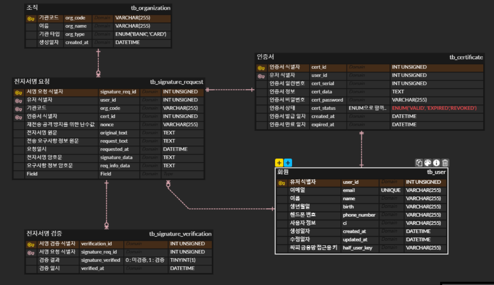
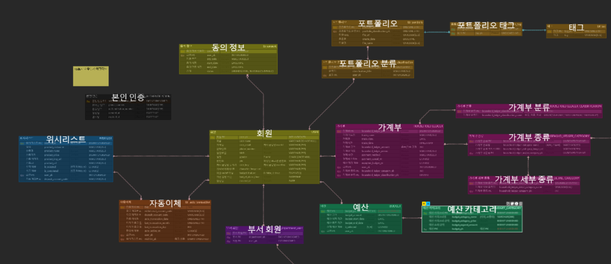
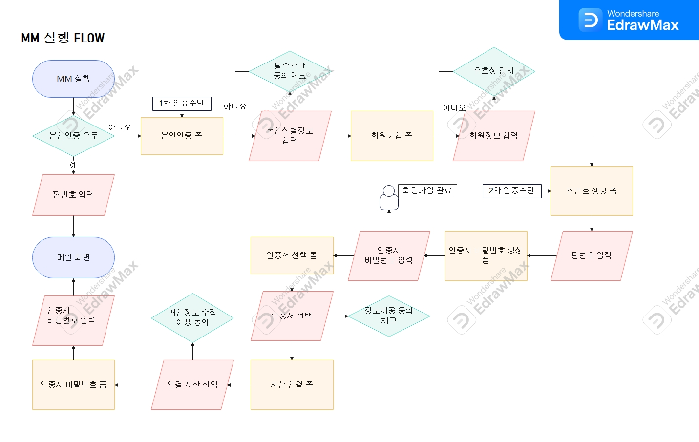
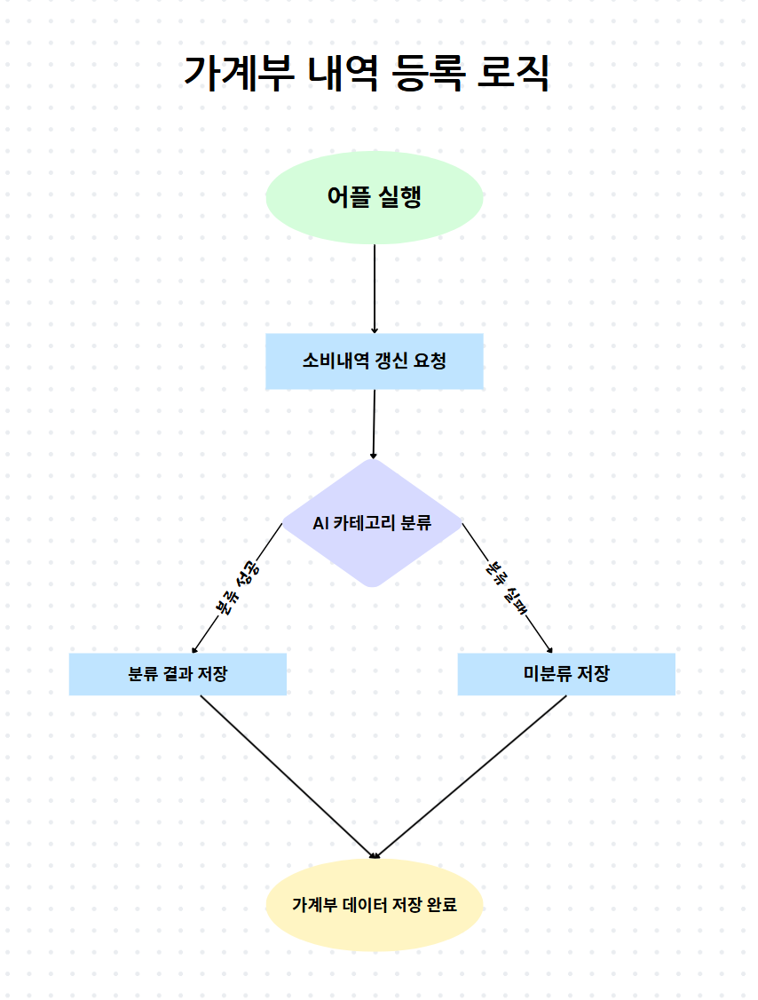
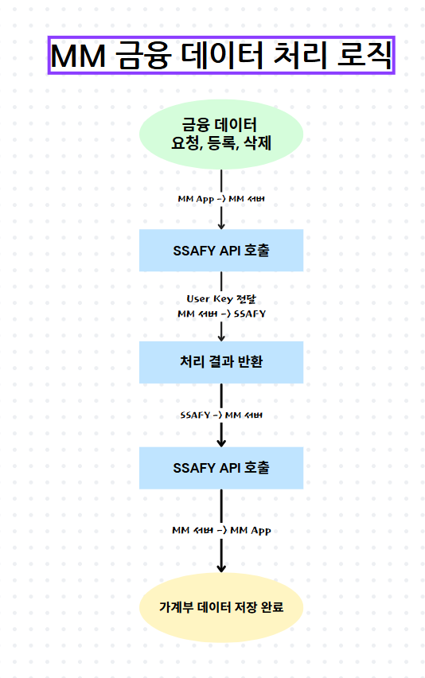
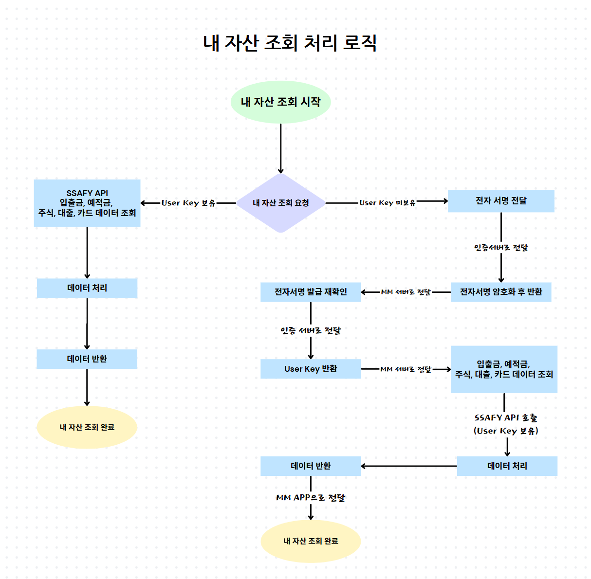
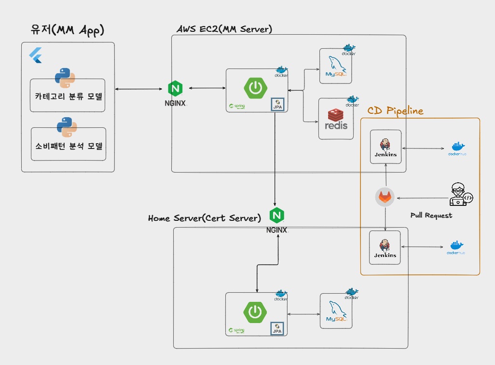

# MM

## 목차

- [MM](#mm)
  - [목차](#목차)
  - [기획서](#기획서)
  - [요구사항 명세서](#요구사항-명세서)
  - [API 명세서](#api-명세서)
    - [금융](#금융)
    - [MM](#mm-1)
    - [회원](#회원)
  - [ERD](#erd)
    - [회원](#회원-1)
    - [MM](#mm-2)
  - [플로우차트](#플로우차트)
    - [MM 시작](#mm-시작)
    - [가계부 등록](#가계부-등록)
    - [금융 데이터](#금융-데이터)
    - [내 자산 조회](#내-자산-조회)
  - [아키텍처](#아키텍처)

## 기획서
PDF 파일 참고 부탁드립니다.

## 요구사항 명세서

## API 명세서
### 금융

### MM

### 회원

## ERD
### 회원

### MM

## 플로우차트
### MM 시작

### 가계부 등록

### 금융 데이터

### 내 자산 조회

## 아키텍처
